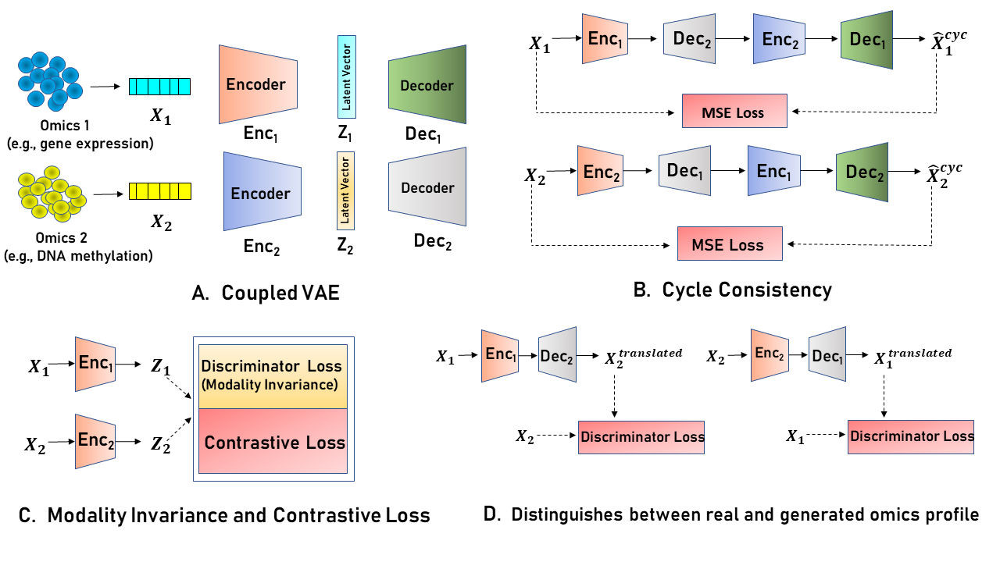

## UnCOT-AD: Unpaired Cross-Omics Translation Enables Multi-Omics Integration for Alzheimer’s Disease Prediction
Alzheimer’s Disease (AD) is a progressive neurodegenerative disorder, posing a growing public health challenge. Traditional machine learning models for AD prediction have relied on single omics data or phenotypic assessments, limiting their ability to capture the disease’s molecular complex ity and resulting in poor performance. Recent advances in high-throughput multi-omics have provided deeper biological insights. However, due to the scarcity of paired omics datasets, existing multi-omics ADprediction models rely on unpaired omics data, where different omics profiles are combined without being derived from the same biological sample, leading to biologically less meaningful pairings and caus ing less accurate predictions. To address these issues, we propose UnCOT-AD, a novel deep learning framework for Unpaired Cross-Omics Translation enabling effective multi-omics integration for AD prediction. Our method introduces the first-ever cross-omics translation model trained on unpaired omics datasets, using two coupled Variational Autoencoders and a novel cycle consistency mechanism to ensure accurate bidirectional translation between omics types. We integrate adversarial training to ensure that the generated omics profiles are biologically realistic. Moreover, we employ contrastive learning to capture the disease specific patterns in latent space to make the cross-omics translation more accurate and biologically relevant. We rigorously validate UnCOT-AD on both cross-omics translation and AD prediction tasks. Results show that UnCOT-AD empowers multi-omics based AD predic tion by combining real omics profiles with corresponding omics profiles generated by our cross-omics translation module and achieves state-of-the-art performance in accuracy and robustness.
### Installation

1. **Clone the repository**:
   ```bash
   git clone https://github.com/abrarrahmanabir/UnCOT-AD.git
   cd UnCOT-AD


2. **Dependencies**

To run the code, ensure you have the following packages installed:

- **Python** >= 3.6
- **Torch** (PyTorch) >= 1.6.0
- **Torchvision** (Optional, depending on model usage in PyTorch)
- **Tqdm** >= 4.41.0 for progress bars
- **Matplotlib** >= 3.2.2 for plotting
- **Pandas** >= 1.1.3 for data manipulation
- **Numpy** >= 1.18.5 for numerical computations
- **Scikit-learn** >= 0.23.2 for model evaluation and preprocessing

3. **Installation**

You can install these dependencies with pip:
```bash
pip install torch torchvision tqdm matplotlib pandas numpy scikit-learn
```


### Usage
1. **Train the Cross Omics Translation Model**:
To start the training process, execute the following command. `Data` folder contains the datasets for training. Running this command will create trained Cross Omics Translation Model which you can use for inference.

   ```bash
   python translation.py

## Inference : Cross Omics Translation and AD Prediction

1. **Prepare the Input Data**:
  `Data` folder contains gene expression, proteomics and DNA methylation datasets.

2. **Load the Pre-trained Model**:
   The pre-trained models are included in `trained models` folder. You can either use these pretrained Cross Omics Translation Models or train them. 

4. **Run the Inference**:
   To perform the experiment of gene expression and proteomics, run the following command:
   
   ```bash
   python gene_prot.py
   ```
   To perform the experiment of gene expression and DNA methylation, run the following command:
   
   ```bash
   python gene_dm.py
   ```
   To perform the experiment of DNA methylation and proteomics, run the following command:
   
   ```bash
   python dm_prot.py
   ```


### Model Architecture



